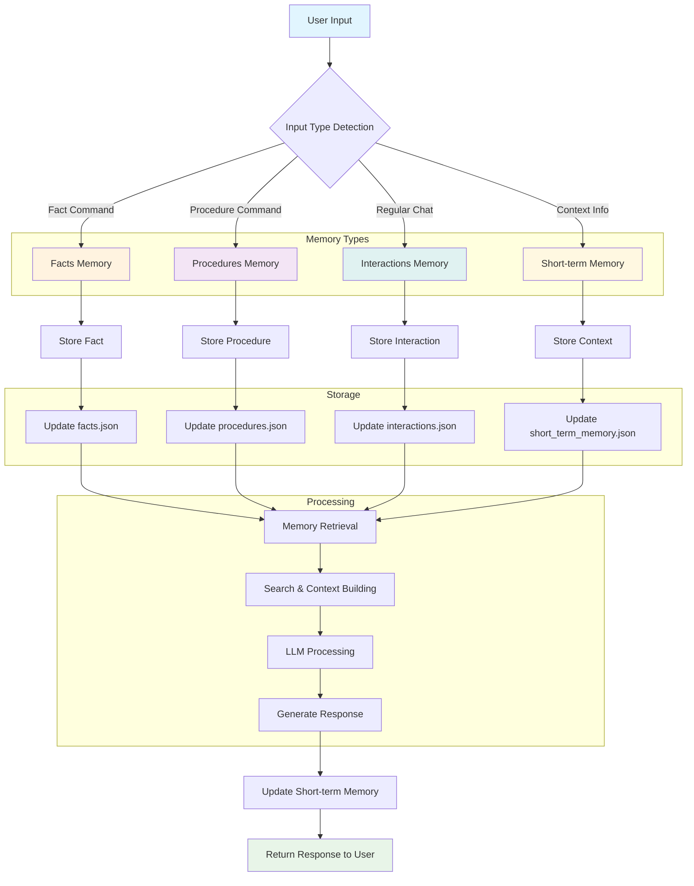
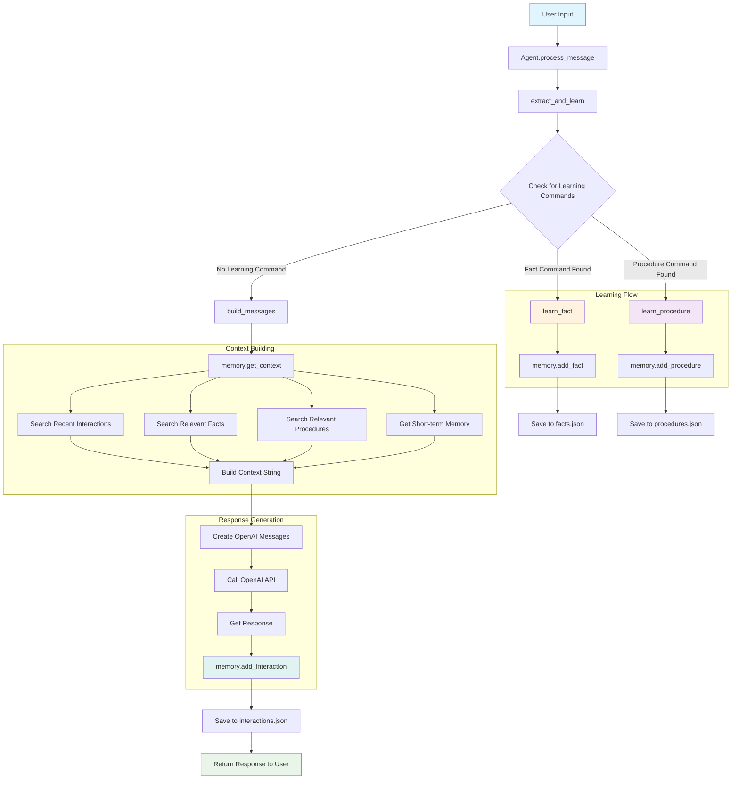

# MemAgent-JSON

A minimal AI assistant with persistent JSON-based memory management. This project implements an intelligent agent that can learn facts, procedures, and maintain conversation history using a structured memory system.

## 🚀 Features

### Memory Management

- **Facts Memory**: Store and retrieve semantic knowledge and facts
- **Procedures Memory**: Learn and execute step-by-step procedures
- **Interactions Memory**: Maintain conversation history and context
- **Short-term Memory**: Fast access to recent, contextually relevant information

### Learning Capabilities

- **Fact Learning**: Learn new facts using natural language commands
- **Procedure Learning**: Learn multi-step procedures with detailed instructions
- **Context-Aware Responses**: Use memory to provide personalized, context-aware answers

### Search & Retrieval

- **Keyword-based Search**: Intelligent search across all memory types
- **Relevance Scoring**: Results ranked by relevance to queries
- **Context Building**: Automatic context generation for LLM interactions

## 🏗️ Architecture

```
memagent-json/
├── agent.py              # Main agent logic and OpenAI integration
├── memory.py             # Core memory management system
├── main.py               # Console chat interface
├── simple_chat.py        # Streamlit web chat interface
├── config/               # Configuration and command definitions
│   └── commands.py      # Single source of truth for command formats
├── json_memory/          # Persistent JSON storage
│   ├── facts.json       # Stored facts and knowledge
│   ├── procedures.json  # Stored procedures and steps
│   ├── interactions.json # Conversation history
│   └── short_term_memory.json # Recent context
├── prompts/              # System prompts and templates
│   └── facts.py         # Initial facts and system prompt
├── utils/                # Core utilities
│   ├── search.py        # Search functionality
│   ├── json_file_utils.py # File operations
│   └── json_parser.py   # JSON parsing utilities
└── tests/                # Comprehensive test suite
    ├── test_agent.py    # Agent functionality tests
    └── test_memory.py   # Memory system tests
```

## 🧠 Memory System Flow



### Process Message Flow



## 🛠️ Installation

1. **Clone the repository**

   ```bash
   git clone <repository-url>
   cd memagent-json
   ```

2. **Install dependencies**

   ```bash
   pip install -r requirements.txt
   ```

3. **Set up environment variables**

   ```bash
   cp env.example .env
   ```

   Edit `.env` and add your API keys:

   ```
   OPENAI_API_KEY=your_openai_api_key_here
   ```

## 🚀 Quick Start

### Run the Web Application (Streamlit)

```bash
streamlit run simple_chat.py
```

### Run the Console Application

```bash
python main.py
```

## 🚀 Getting Started

### Option 1: Web Interface (Streamlit)

Start the interactive web chat interface:

```bash
streamlit run simple_chat.py
```

This will open a web browser with a clean chat interface where you can:

- **Chat naturally** with your AI agent
- **View memory statistics** in real-time (facts, procedures, interactions)
- **See learning examples** right in the interface
- **Watch the agent learn** as you teach it new things
- **No commands to remember** - just type naturally!

**Features:**

- 🧠 Real-time memory visualization
- 💬 Chat bubble interface
- 📊 Memory statistics dashboard
- 🎯 Learning command examples
- 🔄 Persistent memory across sessions

### Option 2: Console Interface

For a simple command-line chat experience:

```bash
python main.py
```

This provides a clean console interface where you can:

- **Chat directly** in your terminal
- **Teach facts and procedures** through natural conversation
- **Exit easily** by typing 'exit', 'quit', or 'bye'
- **No complex commands** - just start chatting!

**Example console session:**

```
🧠 MemAgent Simple Chat
========================================
Chat with an AI that remembers everything!
Type 'exit' to quit.
----------------------------------------
🚀 Initializing agent...
✅ Agent ready! Start chatting below.

👤 You: Remember that my favorite color is blue
🤔 Thinking...
🤖 Assistant: I'll remember that your favorite color is blue!

👤 You: What's my favorite color?
🤔 Thinking...
🤖 Assistant: Your favorite color is blue!

👤 You: exit
👋 Goodbye! Your agent will remember everything you taught it.
```

## 📖 Usage

### Learning Facts

Teach the agent new facts using these formats:

```
Remember that Python is a programming language
Remember this fact: The user's name is John
Remember this knowledge: Machine learning uses algorithms
```

### Learning Procedures

Teach the agent procedures with steps:

```
Remember the procedure making coffee: boil water, add coffee grounds, stir, wait 5 minutes
Remember the steps for greeting: say hello, ask how they are, wait for response
```

### Direct Memory Operations

```python
from memory import Memory

# Initialize memory
memory = Memory()

# Add facts
memory.add_fact("The sky is blue", "semantic")

# Add procedures
memory.add_procedure("Cooking", ["1. Get ingredients", "2. Cook", "3. Serve"], "Cooking a meal")

# Add interactions
memory.add_interaction("Hello", "Hi there!", {"context": "greeting"})

# Add to short-term memory
memory.add_to_short_term_memory("Going to the store")

# Search memory
facts = memory.search_facts("sky")
procedures = memory.search_procedures("cooking")
interactions = memory.search_interactions("hello")
```

### Example from main.py

```python
from memory import Memory

memory = Memory()

memory.add_fact("The sky is blue", "semantic")
memory.add_procedure("Cooking", ["1. Get ingredients", "2. Cook", "3. Serve"], "Cooking a meal")
memory.add_interaction("Hello, how are you?", "I'm good, thank you!", {"weather": "sunny"})
memory.add_to_short_term_memory("I'm going to the store")

print(memory.facts)
print(memory.procedures)
print(memory.interactions)
```

## 🧪 Testing

Run the comprehensive test suite:

```bash
python -m pytest tests/ -v
```

### Test Coverage

The test suite covers:

- **Memory Operations**: Get, search and save operations for all memory types
- **Search Functionality**: Keyword-based search across memory
- **Agent Learning**: Fact and procedure learning capabilities
- **Message Processing**: End-to-end message handling
- **Error Handling**: Graceful error management
- **Data Consistency**: Format validation and structure integrity

## 🔧 Configuration

### Command Formats

All command formats are centralized in `config/commands.py`:

- **Fact Commands**: `["remember that", "remember this", "remember this fact", ...]`
- **Procedure Commands**: `["remember the steps for", "remember the procedure", "remember the steps"]`

### Memory Settings

- **Short-term Memory Size**: Configurable limit (default: 10 items)
- **Search Limits**: Configurable result limits (default: 3 items)
- **Storage Location**: Configurable JSON storage directory

## 🏛️ Design Principles

### Single Source of Truth

- Command formats defined once in `config/commands.py`
- Consistent format validation across the system
- Centralized configuration management

### Memory Hierarchy

1. **Short-term Memory**: Fast access, recent context
2. **Facts Memory**: Semantic knowledge and facts
3. **Procedures Memory**: Step-by-step instructions
4. **Interactions Memory**: Conversation history

### Error Handling

- Graceful degradation on API failures
- Comprehensive input validation
- Detailed error messages for debugging

## 🔍 Search Algorithm

The search system uses keyword-based matching with relevance scoring:

1. **Query Processing**: Split into individual terms
2. **Case-insensitive Matching**: Find terms in content
3. **Scoring**: Count matching terms per item
4. **Ranking**: Sort by relevance score
5. **Limiting**: Return top N results

## 📊 Memory Structure

### Facts

```json
{
  "fact": "The sky is blue",
  "type": "semantic",
  "timestamp": "2025-06-18T17:53:05.784571"
}
```

### Procedures

```json
{
  "name": "Cooking",
  "description": "Cooking a meal",
  "steps": ["1. Get ingredients", "2. Cook", "3. Serve"],
  "timestamp": "2025-06-18T17:59:13.273291"
}
```

### Interactions

```json
{
  "user_message": "Hello, how are you?",
  "agent_message": "I'm good, thank you!",
  "metadata": { "weather": "sunny" },
  "timestamp": "2025-06-18T17:53:05.784828"
}
```

### Short-term Memory

```json
{
  "content": "I'm going to the store",
  "importance": 1.0,
  "timestamp": "2025-06-18T17:59:13.273571"
}
```

### Development Guidelines

- **Testing**: Write comprehensive tests for all new features
- **Documentation**: Update README and docstrings
- **Code Style**: Follow Python PEP 8 guidelines
- **Error Handling**: Implement graceful error handling
- **Consistency**: Maintain single source of truth principles
